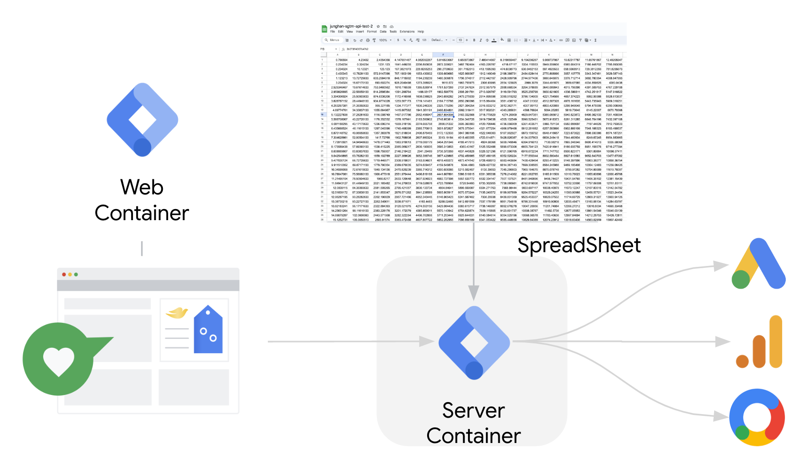
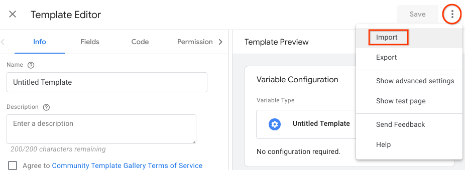
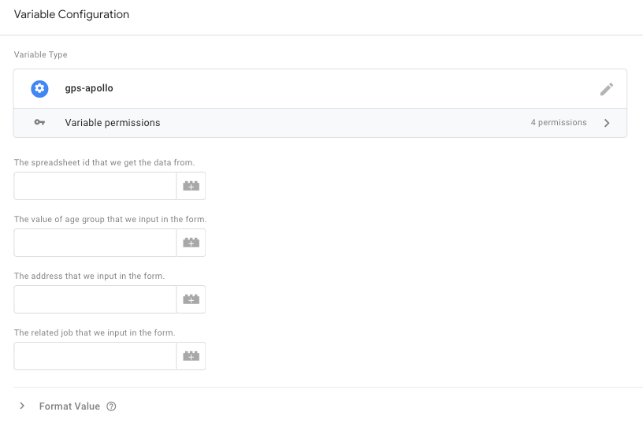
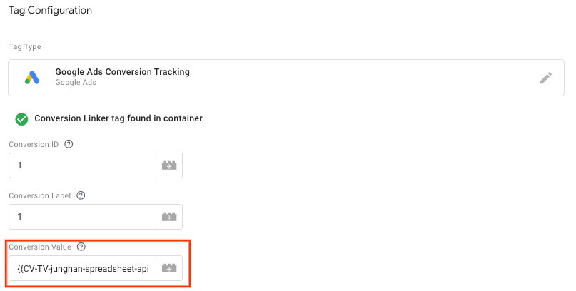
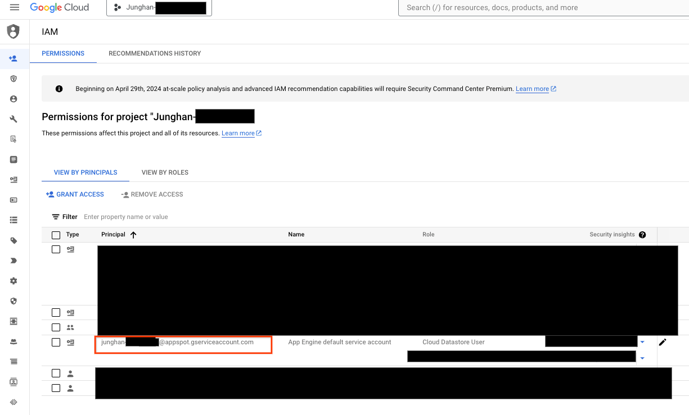
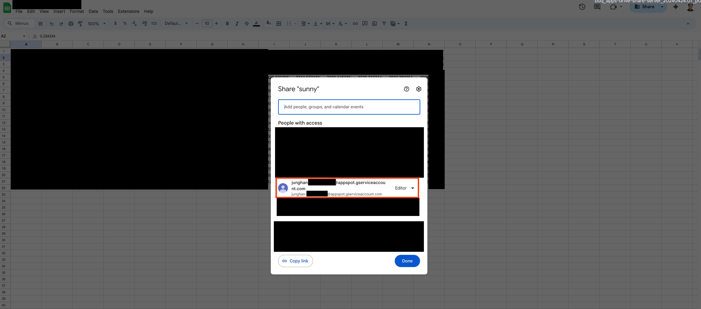

# gPS Apollo

*Get data from a Google Sheet in realtime to generate lead gen value
for lead scoring. This value will be activated via VBB (value based bidding) to
optimize Google Ads campaign performance*

Use
[Server Side Tag Manager](https://developers.google.com/tag-platform/tag-manager/server-side)
with [Spreadsheet API](https://developers.google.com/sheets/api/guides/concepts), 
to generate real time
conversion value and use them with Google Ads products and other
services to improve your targeting and bidding processes.

> Tip 💡: Check out [the sGTM Pantheon](
    https://github.com/google-marketing-solutions/gps-sgtm-pantheon/tree/main)
for more tags for different use-cases.

## Description


We know that the client begins with the user clicking on the ad
and arrives at the website then the user browses your site,
reads about your product and services
and then later fills in a form on the site and becomes a lead for the business.
This will be stored in the CRM and database and then later when a lead is closed,
this will be uploaded in Google Ad.

So looking at the above workflow, 
you can see that there are several cons here.
First it can take several weeks or days for lead gen clients 
to know the true value of conversion. 
And we know that the longer time it takes to upload the closed lead information, 
the less impact it would have on bidding.


So our solutions improve or enhance the current standard of workflow, 
if you look at the third step, we have two options.

The first option is gPS-Apollo solution,
which you're reading now.

It is using a spreadsheet to pass the conversion value, 
think of the spreadsheet as a lookup table based on the user’s input in the form. 
We are able to pass the conversion value using the server side GTM.

The second option is [gPS-Phoebe solution](https://github.com/google-marketing-solutions/gps-phoebe)
instead of using a spreadsheet. 
We will be using Google Cloud’s Vertex AI to be able to predict the conversion value 
and pass it through server side GTM.
Now that we have the predicted value and lead scoring, 
we can easily activate this via VBB.

So let’s look at the pros of this solution. 
So conversion value is passed in real time. 
Conversion modeling is also supported. 
We do not need to worry about batch upload or maintaining any spreadsheets or files. 
And the last but not the least, 
server side tagging is a solution that focuses on privacy 
and measurement and conversion value is also hashed.


The image below provides a high level overview of the core components involved,
and outlines the flow.



1.  A GTM web container is used to set up tagging on the site, and is configured
    with a “sign_up” event.
2.  The client’s website is set up to have a sign_up event in the
    data layer: this contains the form data. When a user signs up, the
    event fires, sending the payload to a GTM server container.
3.  The custom variables (e.g. age group, related job and address) are attached to a tag, 
    triggered by “sign_up” events,
    which get a vale from the prepared spreadsheet
    and replaces the conversion value with the predicted value.
4.  The updated event (with the conversion value) is sent to Google
    Analytics, Google Ads or Floodlight.

## Demo Implementation

If you are interested in the demo site, you can visit [the test site](https://junghan-fe.com/ga4/apac/nz/submit/)
and input data and click the "Submit" button in the Option 1.
Otherwise, skip to the next section for the implementation guide.

## Implementation Guide

### Requirements

*   A Google Cloud project with billing enabled
*   A GTM server container up and running, and receiving events from a GTM web
    container
*   A prepared spreadsheet that has values with 3 dimensions. 
   (e.g. the related job at the bottom. age group at the left tap 
    and the address at the top)
    
* There are [quotas and limitations](https://developers.google.com/sheets/api/limits) for Google Sheets API.


### Prepare the environment

Clone the repository to a local folder in your current environment (we recommend
using cloud shell for the deployment as it provides all required utilities out
of the box), using this command:

```sh
git clone https://github.com/google/gps-apollo
```

If you are not using cloud shell, you must install the
[gcloud CLI](https://cloud.google.com/sdk/docs/install) in your environment.

### Configure Tag Manager

#### Import the template

Download the template file [here](gtm/variable_template.tpl).

From the Google Tag Manager UI, select your server container, go to the
`Templates` section, and click on `New`:


Then, click on the top right options button, and select `Import`:



Select the file you downloaded and continue. Then, click on `Save` and close the
template using the top left close button.

#### Create the variable

Now, from the Google Tag Manager UI, go to the `Variables` section, and click on
`New`:


Click on `Variable Configuration`to select a variable type:


And select `gps-apollo`:


Then, fill in the details of your environment in the configuration screen:




Finally, to add the predicted value coming from Spreadsheet to the signup or
conversion event, open the appropriate Tag and replace the conversion value (or
equivalent) field with the variable you just created.

For example, in Google Ads Conversion Tracking, you can use the `Conversion
Value` field:



## Permissions

The template uses sGTM's `getGoogleAuth` API, which uses Google Cloud's
[Application Default Credentials](
https://cloud.google.com/docs/authentication/application-default-credentials)
to access the service account running sGTM.

Open up [IAM](https://console.cloud.google.com/iam-admin/iam) in Google Cloud,
and copy your app engine or cloud run service account.



and paste it into the spreadsheet for editor.



## Disclaimers

**This is not an officially supported Google product.**

*Copyright 2024 Google LLC. This solution, including any related sample code or
data, is made available on an “as is,” “as available,” and “with all faults”
basis, solely for illustrative purposes, and without warranty or representation
of any kind. This solution is experimental, unsupported and provided solely for
your convenience. Your use of it is subject to your agreements with Google, as
applicable, and may constitute a beta feature as defined under those agreements.
To the extent that you make any data available to Google in connection with your
use of the solution, you represent and warrant that you have all necessary and
appropriate rights, consents and permissions to permit Google to use and process
that data. By using any portion of this solution, you acknowledge, assume and
accept all risks, known and unknown, associated with its usage, including with
respect to your deployment of any portion of this solution in your systems, or
usage in connection with your business, if at all.*
